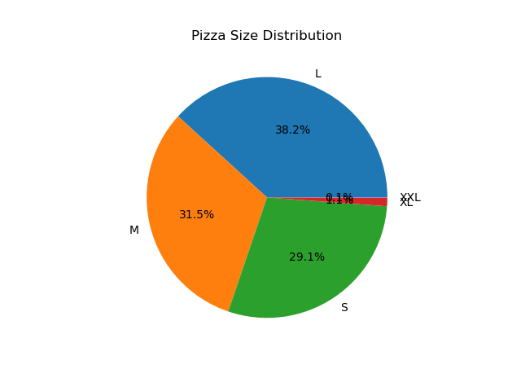
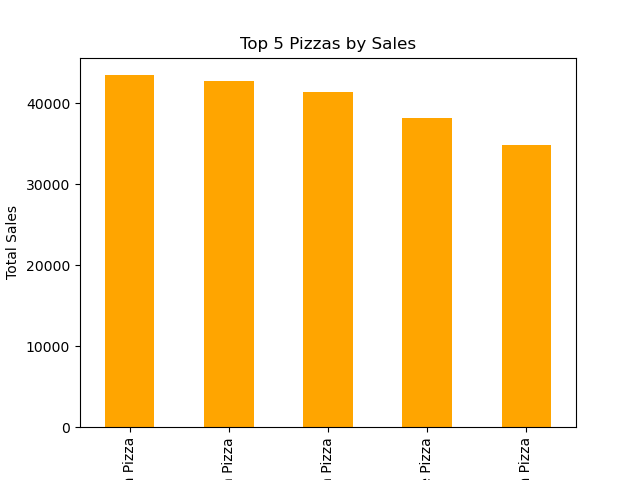

# Pizza Sales Analysis

#  Project Overview
This project analyzes pizza sales data to uncover insights about:
- Sales by category
- Sales by pizza size
- Top-selling pizzas by revenue
- Most ordered pizzas by quantity

#  Dataset
The dataset contains **48,620** orders with the following columns:
- `pizza_id` - Unique ID for each pizza
- `order_id` - Unique order number
- `pizza_name_id` - Pizza name ID
- `quantity` - Quantity ordered
- `order_date` - Date of order
- `order_time` - Time of order
- `unit_price` - Price per pizza
- `total_price` - Total order price
- `pizza_size` - Size of pizza (S, M, L, XL, XXL)
- `pizza_category` - Category (Classic, Chicken, Supreme, Veggie)
- `pizza_ingredients` - Ingredients list
- `pizza_name` - Full pizza name

#  Key Insights
- **Highest revenue category**: Classic
- **Most popular size**: Large (L)
- **Top 3 pizzas by revenue**:
  1. The Thai Chicken Pizza
  2. The Barbecue Chicken Pizza
  3. The California Chicken Pizza
- **Top 3 pizzas by quantity sold**:
  1. The Classic Deluxe Pizza
  2. The Barbecue Chicken Pizza
  3. The Hawaiian Pizza

#  Tools Used
- Python
- Pandas
- Matplotlib
- Jupyter Notebook

#  How to Run
1. Clone the repository:
   ```bash
   git clone https://github.com/Rohithyadav048/pizza-sales-analysis.git


### Pizza Size Distribution


### Sales by Category


## Top 5 pizza sales
